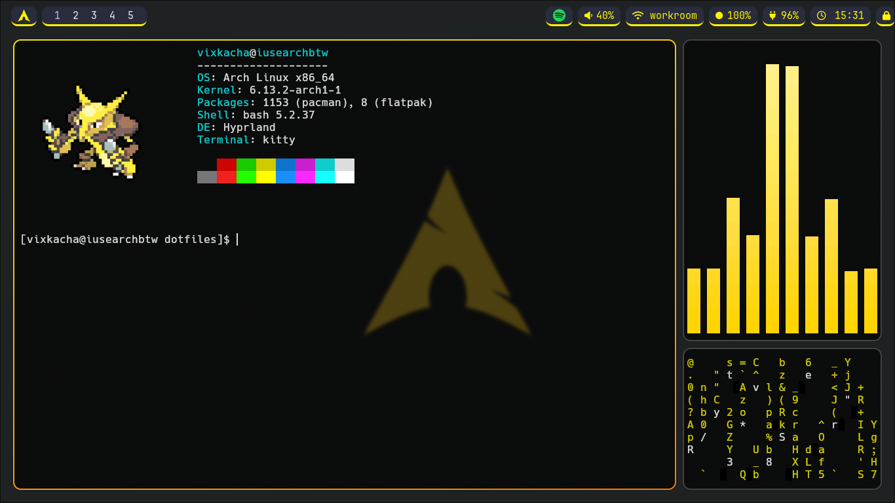
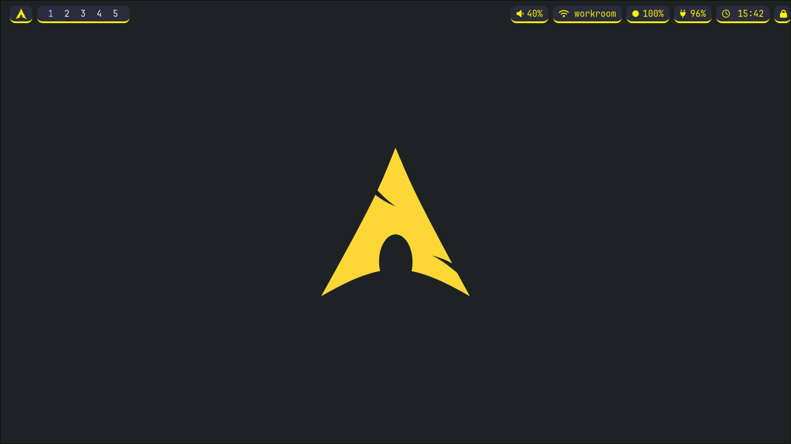
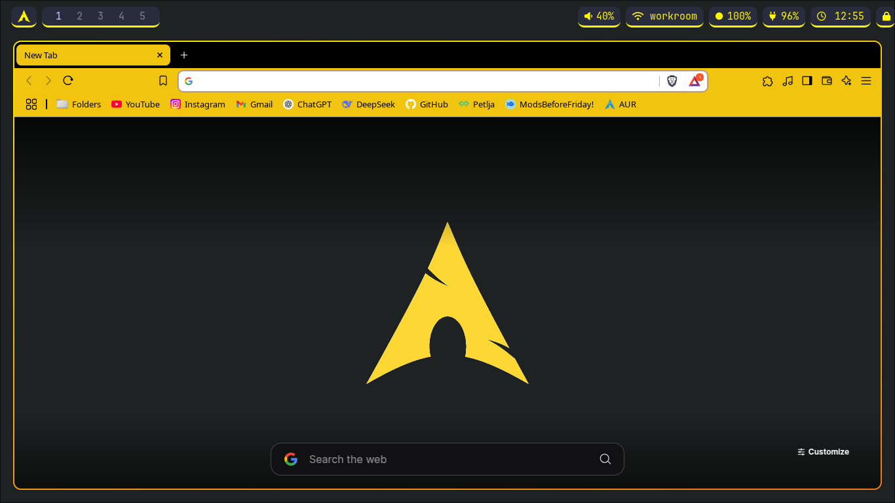
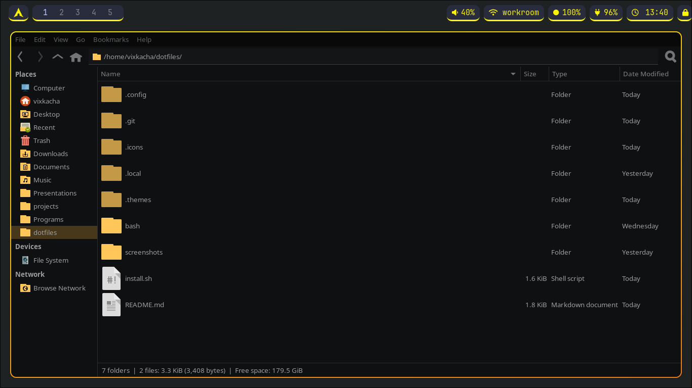

# Disclaimer
Some things about it are still incomplete (like .config/hypr/autostart.conf - its inconsistent in the sizing for some reason). Just use it if you are willing to figure things out. Pull requests are welcome.

# Tools

My yellow dotfiles for [hyprland](https://hyprland.org/) :)

Bar - [Waybar](https://github.com/Alexays/Waybar)

Audio Visualizer - [Cava](https://github.com/karlstav/cava)

Wallpaper - [Hyprpaper](https://github.com/hyprwm/hyprpaper)

App launcher - [Rofi](https://github.com/davatorium/rofi)

GTK theme - [Material black mango](https://www.gnome-look.org/p/1316887)

Icon theme - [Material black mango NUMIX flat](https://www.gnome-look.org/p/1333360)

Brave (Chrome) theme - [Black Yellow Flat](https://chromewebstore.google.com/detail/black-yellow-flat/hanlhmlmbgbpnnaiddofndfapnklikpp)

## Installation
The install script will back up your old dotifles to ~/old-dotfiles-backup-365 (there is no way you already have this folder xD)

Clone this repo to ~/dotfiles

```bash
cd ~
mkdir dotfiles
cd dotfiles
git clone https://github.com/VixKacha/dotfiles
```
Make install.sh executable and run it
```bash
chmod +x install.sh
./install.sh
```

## Screenshots




## To-do
- [ ] Fix sizing on startup apps
- [ ] Fix the alakazam image weirdly changing size every time you start neofetch
- [ ] Find other bugs in the config and improve on it
- [ ] Keybinds table
## Credits
Wallpaper - [Link](https://github.com/errordotfiles/awesome-dotfiles/tree/dotfiles)

[ML4W's hyprland starter](https://github.com/mylinuxforwork/hyprland-starter) - Definately start with these if you wanna make your own config and have no idea what youre doing

This [Rofi themes collection](https://github.com/newmanls/rofi-themes-collection)

[Neovim Kickstart](https://github.com/nvim-lua/kickstart.nvim)

If i missed any let me know.
